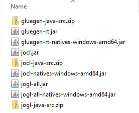
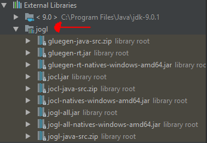

# CyberGPUAttack
Implementation of a Birthday Attack demonstration using OpenCL

# Downloads:
Download the 'jogamp-all-platforms.7z' from the following website: http://jogamp.org/deployment/jogamp-current/archive/

Copy the files for the 'Windows 64-bit Native' Installation here:

http://jogamp.org/wiki/index.php/Downloading_and_installing_JOGL#Downloading_the_latest_stable_version

# Installation:

To install the JOCL and JOGL libraries, do the following:

1. Extract the downloaded `jogamp-all-platforms.7z` archive to a directory.
2. Create a new directory called `jocl`, and copy the following files from the extracted folder to the `jocl` directory (Assuming a 64-bit Windows install).
    * `gluegen-java-src.zip`
    * `jar/gluegen-rt.jar`
    * `jar/gluegen-rt-natives-windows-amd64.jar`
    * `jar/jocl.jar`
    * `jocl-java-src.zip`
    * `jar/jocl-natives-windows-amd64.jar`
    * `jar/jogl-all.jar`
    * `jar/jogl-all-natives-windows-amd64.jar`
    * `jogl-java-src.zip`
3. Your `jocl` directory should look like this:

    
4. Open IntelliJ and navigate to `File->Project Structure->Modules`
5. Click the green plus sign on the right, and then navigate to `Library->Java`.
6. Navigate to the `jocl` folder and select it.
7. IntelliJ will give you some info about what libraries are being imported. Click OK.
8. Check that the libraries are installed correctly by navigating to the `External Libraries` section in the `Project` tab.
9. Your `External Libraries` tab should look like this:

    
10. Done! Move on to the Setup section to setup the project to run in IntelliJ

# Setup
To setup the project to run in IntelliJ:
1. Navigate to `File->Project Structure->Project->Project SDK` and select your Java SDK (SDK 8 or above). You may need to specify the path
manually if the SDK does not show up.
2. Set `Project Language Level` (Just below the `Project SDK` setting) to 8 or above.
3. Set the 'Compiler Output Directory' (Just below `Project Language Level`) to the `out/` folder inside the project.
4. Hit `Apply` and `OK`, and then build and run the code!